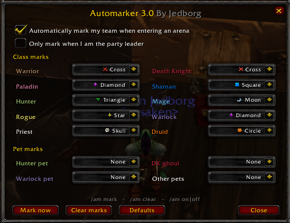

# Automarker 3.0 — By Jedborg

A lightweight World of Warcraft **3.3.5a (WotLK)** addon that automatically puts raid target icons on everyone in your team the moment you enter an arena — players and pets alike. No more fumbling with marks during preparation.

## What it does

When you zone into an arena, AutoMarker assigns each teammate a raid target icon based on their class, then keeps watching for about two minutes to make sure the marks actually stick — covering the preparation room, the gates opening, and the client occasionally dropping a mark right after a loading screen. Pets are marked automatically when they are summoned, even mid-match.

## Features

- **Fully automatic** — marks your whole team on arena entry, re-applies anything that gets dropped, and clears stale marks left over from before the match.
- **Configurable per class** — every one of the 10 classes has its own mark, chosen in a simple in-game GUI.
- **Pet marks** — separate settings for hunter pets, warlock demons, death knight ghouls, and everything else (defaults to off).
- **Smart conflict handling** — if two teammates want the same icon, the second one automatically gets the first free icon. Assignments are computed deterministically (sorted by player name), so two teammates both running AutoMarker will never fight over the marks.
- **Plays nice** — a "only mark when I am the party leader" option, manual mark/clear commands, and settings that persist between sessions.

## Installation

1. Download the repository (**Code → Download ZIP**).
2. Copy the folder into your WoW directory as `Interface\AddOns\AutoMarker\` — it should contain `AutoMarker.toc` and `AutoMarker.lua`.
3. Restart the client (or `/reload`) and make sure **AutoMarker** is enabled on the character selection AddOns screen.

## Usage

The addon works out of the box — just queue for an arena. To configure it:

| Command | Effect |
|---|---|
| `/am` or `/automarker` | Open/close the configuration window |
| `/am mark` | Apply marks right now (works anywhere, not just arenas) |
| `/am clear` | Remove all marks from your group |
| `/am on` / `/am off` | Enable/disable automatic arena marking |

The configuration window lets you pick a mark (or **None**) for every class and pet type via dropdowns, toggle automatic marking, and restore the defaults with one click.

## Default marks

| Icon | Class |
|---|---|
| ⭐ Star (1) | Rogue |
| 🟠 Circle (2) | Druid |
| 🟣 Diamond (3) | Paladin, Warlock |
| 🟢 Triangle (4) | Hunter |
| 🌙 Moon (5) | Mage |
| 🟦 Square (6) | Shaman |
| ❌ Cross (7) | Warrior, Death Knight |
| 💀 Skull (8) | Priest |

Since there are 10 classes and only 8 icons, some classes share a preferred icon — when both are in your team, the conflict is resolved automatically: the first player (sorted by name) keeps the preferred icon and the other gets the first free one. Pet marks default to **None**; enable them in the GUI if you want them.

## Good to know

- In a party (which arena teams are), *any* member can set raid marks in 3.3.5 — so the addon works even when you are not the leader. If several teammates run AutoMarker with *different* settings, enable **"Only mark when I am the party leader"** to avoid them overwriting each other.
- The addon only marks automatically in arenas. Use `/am mark` to mark your group anywhere else (in a raid this requires lead or assist, as usual).
- Settings are saved per account in `WTF\Account\<ACCOUNT>\SavedVariables\AutoMarker.lua`.
